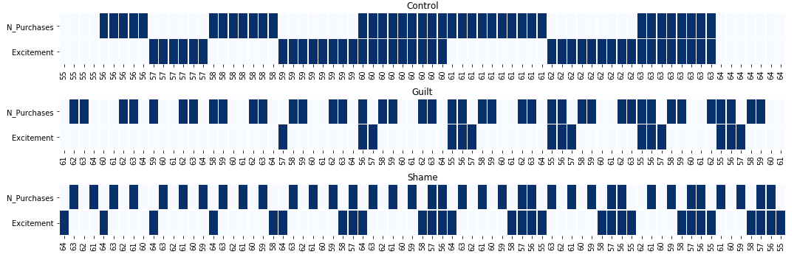
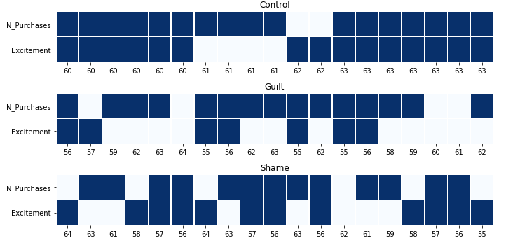

pysprite: A Python 3 Re-Implementation of Heathers et al. 'Sample Parameter Reconstruction via Iterative TEchniques (SPRITE)'
===========================================================================

# I. Acknowledgments

The [SPRITE procedure](https://peerj.com/preprints/26968/), and the original code on which this library is based,
were developed by [James Heathers](http://jamesheathers.com/), [Jordan Anaya](http://www.omnesres.com/), 
[Tim van der Zee](http://www.timvanderzee.com/) and [Nicholas JL Brown](http://steamtraen.blogspot.com/).

# II. Manifest

The original code was only available for Python 2.7 (which is being shifted out of existence), and was not very... 
pythonic, which made it difficult for researchers to extend the codebase and add new features. 

The current library re-implements the features of the original code in Python 3. It features:
 * A class-oriented, easily-extensible codebase, 
 * Some features that were only available in other implementations of SPRITE (e.g., the ability to specify restrictions 
 in a more flexible way). 
 * A test suite to facilitate development.

# III. Installation
pysprite is available on Pypi:

`pip install pysprite`

# IV. Using pysprite

## 1. Initialization
In pysprite, a Sprite object must first be initialized as follow:

```python
from pysprite import Sprite
npart = 20
m = 3.02
sd = 2.14
m_prec = 2
sd_prec = 2
min_val = 1
max_val = 7
s = Sprite(npart, m, sd, m_prec, sd_prec, min_val, max_val)
```

As in the original library, the initialization will fail if:
* The mean is smaller (greater) than the minimum (maximum) of the scale
* The mean is not possible given the precision and sample size (i.e., the GRIM test fails)

Unlike the original library however, pysprite will not return anything at this stage. 

## 2. Find a possible distribution
To find a possible distribution, the `find_possible_distribution()` method must be called after initialization.

The following parameters can be used:
* `init_method`: The initialization method of the distributions. One of `minvar`, `maxvar`, or `random`. 
* `max_iter`: The maximum number of iterations to run across all distributions.

````python
result = s.find_possible_distribution()
print(result)

result = ['Success', np.array([1, 1, 1, 1, 1, 1, 1, 1, 1, 1, 6, 6, 4, 5, 5, 5, 5, 5, 5, 5]), 2.14]
````

As in the original library, `result` is always a tuple of `(outcome, dist, sd)` where:
* `outcome`: 'Success' or 'Failure', indicating whether a suitable distribution was found.
* `dist`: A suitable distribution (or the closest thing to a suitable distribution if SPRITE failed).
* `sd`: The standard deviation of the suitable distribution (or of the closest distribution if SPRITE failed).


## 3. Get a list of possible distributions
The `find_possible_distributions()` (with an s) method is available to sample several suitable distributions.

The following parameters can be used:
* `n_dists`: The number of distributions to find.
* `init_method`: The initialization method of the distributions. One of `minvar`, `maxvar`, or `random`. 
* `max_iter`: The maximum number of iterations to run across all distributions.

````python
possible_dists = s.find_possible_distributions()
print(possible_dists)

possible_dists = ['Success', [np.array([1, 1, 1, 1, 1, 1, 1, 1, 2, 2, 6, 6, 6, 6, 6, 3, 3, 3, 5, 5]), ...], 10]
````

With this method, `possible_dists` is a tuple of `(outcome, dists, k)` where:
* `outcome`: 'Success' or 'Failure', indicating whether the appropriate number of distribution was found.
* `dists`: A list of suitable distributions (or an empty list of none was found).
* `k`: The number of suitable distributions found.

## 4. Advanced usage: Specifying restrictions
In pysprite, restrictions are a dictionary of `{values: counts}` that must be present in the candidate distribution.

For instance, we want to specify that participants answered on a scale from 0 to 8, but that none of them answered `4`,
and that two of them answered `3`:

```python
npart = 20
m = 3.25
sd = 2.05
m_prec = 2
sd_prec = 2
min_val = 1
max_val = 7
restrictions = {3: 2, 4: 0}
s = Sprite(npart, m, sd, m_prec, sd_prec, min_val, max_val, restrictions=restrictions)
```

With restrictions, the initialization will fail if:
* The mean is smaller (greater) than the minimum (maximum) of the scale
* The mean is not possible given the precision, sample size, and restrictions (i.e., the GRIM test fails)
* The restrictions are invalid (e.g., they are outside the scale, or one of the bounds of the scale is restricted to
have zero values).

When restrictions are specified, the `init_method` argument `find_possible_distribution()` and 
`find_possible_distributions()` has no effect. The distribution will always be initialized at random, such that it
conforms to the restrictions.

## 5. Advanced usage: Multi-scale items.
pysprite supports distributions obtained from multi-scale items. For instance, assume that all participants rated how
beautiful three birds are (on a scale from 1 to 7), and that the dependent variable is the average of those two ratings.

You can specify that the scale had two items using the `n_items` keyword:

```python
npart = 32
m = 2.35
sd = 1.7
m_prec = 2
sd_prec = 2
min_val = 1
max_val = 7

s = Sprite(npart, m, sd, m_prec, sd_prec, min_val, max_val, n_items=3)
```

Under the hood, pysprite will:
* Construct a response scale including non-integer values: [1, 4/3, 5/3, 6/3, ..., 20/3, 21/3]. 
* Perform the GRIM check, taking into account that the scale has more granularity than a single item scale.
* Check if this scale can produce a distribution with the reported summary statistics.

# V. Utilities

The library also include some utilities that can be useful to establish a diagnostic of pathological data.

## 1. The `grim()` function

A simple implementation of the GRIM test.

```python
from pysprite import grim
npart = 32 # 32 participants
m = 2.35 # Mean
prec = 2 # Decimal precision of the mean
n_items = 1 # The mean was computed from a single item measure
possible = grim(npart, m, prec=prec, n_items=n_items) # Returns True or False
```

## 2. The `GrimSearch` object

It is frustrating when a paper reports the means of multiple variables for multiple cells, but omits the sample size 
per cell. In this case, the only solution was to run the GRIM test multiple times over multiple combination of cell 
sizes, and to check if one (or multiple) solutions were possible. 

GrimSearch automates this search procedure, and automatically returns the solution(s)!

Let's take the following example: 

* A study with three conditions: "Control", "Guilt", and "Shame". 
* For each condition, the authors report the means score on two items: "N_Purchases" and "Excitement".
* We know the total N: 180
 
```python
from pysprite import GrimSearch

n = 180 # 180 participants in total

# Matrix of means: One row per cell, one column per variable.
mus = [[6.43, 2.63], # N_Purchases and Excitement for "Control"
         [2.71, 6.04], # ... for "Guilt"
         [2.54, 2.09]] # ... for "Shame"

precs = [2, 2] # Decimal precision of the variables

n_items = [1, 1] # The mean of both variables was computed from a single item measure

max_diff = 10 # To reduce the number of cell sizes to consider, let's set the maximum difference in N per cell at 10.
varnames =["N_Purchases", "Excitement"]
cellnames = ["Control", "Guilt", "Shame"]

gs = GrimSearch(n, mus, precs, n_items, max_diff, varnames, cellnames)
```

We have initialized the procedure, now let's see if it can find a solution.

```python
gs.find_solutions()
# No solution!
```

Assuming a sample size per cell between 55 and 64, we cannot find a solution. Let's get a better idea of how close (far)
we are from a solution by plotting the results:
 
```python
gs.plot_grim_checks(plot_kwargs={"figsize":(15, 5)})
```


In this plot, each column corresponds to combination of cell sizes that is consistent with the total N, and each row to
a cell/variable pair. A pale (vs. dark) blue rectangle means that the cell/variable pair is GRIM-inconsistent 
(vs. GRIM-inconsistent) given the cell size. A solution would appear as a full row of dark blue rectangles:  here, we 
do not see any.

If there are too many cell size combinations, you can choose to only plot those in which more than X variable/pairs are
GRIM-consistent, using the `threshold` keyword.

```python
gs.plot_grim_checks(threshold=4, plot_kwargs={"figsize":(10, 5)})
```


Finally, you can export this summary of GRIM checks to a dataframe:

```python
gs.summarize_grim_checks()
```

|   Combination       |  Cell Name       |  Cell Size  |  Variable           | Valid   |
|----------|---------|----|-------------|-----|
| 55-61-64 | Control | 55 | N_Purchases | 0.0 |
| 55-61-64 | Guilt   | 61 | N_Purchases | 0.0 |
| 55-61-64 | Shame   | 64 | N_Purchases | 0.0 |
| 55-61-64 | Control | 55 | Excitement  | 0.0 |
| 55-61-64 | Guilt   | 61 | Excitement  | 0.0 |
| 55-61-64 | Shame   | 64 | Excitement  | 1.0 |
| 55-62-63 | Control | 55 | N_Purchases | 0.0 |
| 55-62-63 | Guilt   | 62 | N_Purchases | 0.0 |
| 55-62-63 | Shame   | 63 | N_Purchases | 1.0 |
| 55-62-63 | Control | 55 | Excitement  | 0.0 

# VI. Changelog

## 1.1.2: Master
* Fixed a bug that could cause the "maxvar" initialization procedure to crash
* Improved numerical precision
* Speed-up of variance comparisons.


## 1.1.0
* Support for multi-item scales.

## 1.0.0: Initial release
* Support for scales of one item only.


# VII. Development

## 1. Running tests

````cmd
pip install pytest
pytest
````


